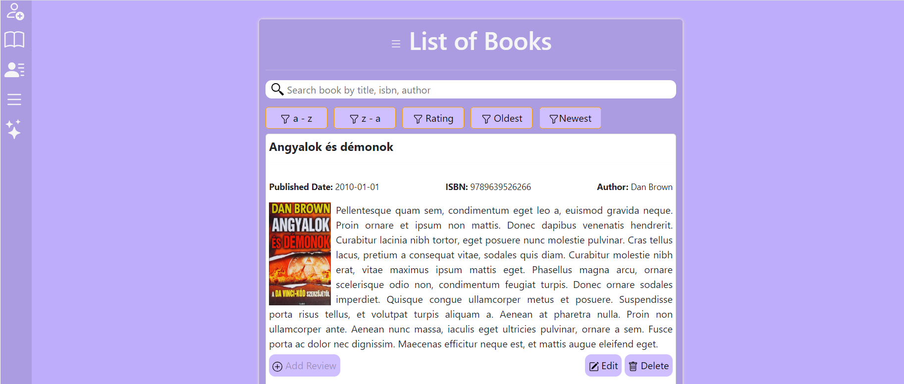
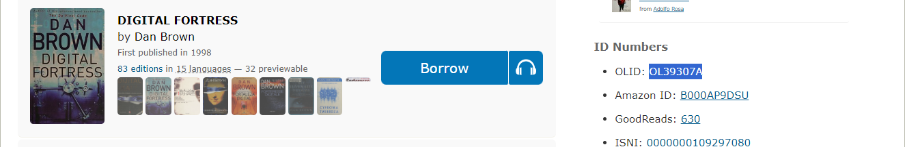
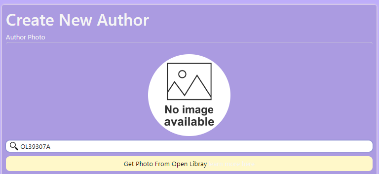
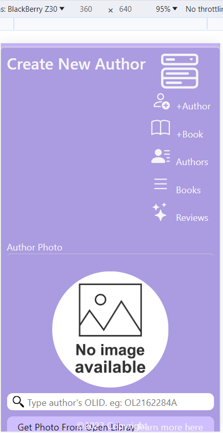

# Book Review Website
**Book Review Website** it's one of the Capstone's project from The Complete 2023 Web Development Bootcamp tought by [Dr. Angela Yu](https://github.com/angelabauer) Lead Instrutor at [Appbrewery](https://www.appbrewery.co/) and furthermore she is one of [Udemy](https://www.udemy.com/)'s most popular instructor with almost 5 stars.

The idea is to register every book that you ever read and then take some notes about the most salient parts of the book. Moreover, you will need to register the book first, soon after you'll have to tell when you read it and what are the chances to recommend it to someone else.

## Functionalities:

- Author ( CRUD )
    + Get authors pictures from [open library](https://openlibrary.org/dev/docs/api/covers)
- Book ( CRUD )
    + Get books covers from [open library](https://openlibrary.org/dev/docs/api/covers)
- Review ( CRUD )

## Tecnologies:

- Front-end:
    + HTML and CSS
    + Javascript
    + JQuery
    + EJS
    + [SweetAlert](https://github.com/sweetalert2/sweetalert2) 
- Back-end:
    + [Axios](https://www.npmjs.com/package/axios) ( API )
    + [Body-Parser](https://www.npmjs.com/package/body-parser)
    + Javascript
    + Express.js
    + Node.js
    + PostgresQL

## Installation

First of all you need to make sure that you have node.js running in your server or local machine (assuming that you have downloaded and installed it). Open **terminal** on Linux or **cmd** on windows and run the following command:

> node

If you do have node running on your machine it should reply a message like shown below, but probabilly the version of your node will be different from mine:

> Welcome to Node.js v18.17.0.

Upon accomplishment of the aforementioned steps, you will be all set regarding node installation and you can now install all nodes dependecies, by running the following command:

> npm i

Now, you can run the application:

> node index.js

If everything goes well, you should have the following message in your command line:

> Server is running on port 3000

## Usage

Open your browser and type the following text in your address bar:

> localhost:3000

## Lateral Menu

## Create a new Author

Since authors' pictures are grabbed from Open Library through author's internal code (OLID - Open Library ID ), you have to get ahold of this ID. As an example let's get Dan Brown's OLID:

**Step 01:** Search for Dan Brown

**Step 02:** Copy Dan Brown ID

**Step 03:** Go to new author screen and paste this ID

**Step 04:** Click button **'Get Photo From Open Library'**

**Step 05**: Result

If you put wrong ID will get an error message like this one:

**Note:** Create a book works similarly.

## Create a new Review

To create a **new Review** go to the **List Books** item menu and after the book list open, you have choose the book you want to review and then click on **Add Review** button.

**Step 01:**

**Step 02:**

## Responsive

This website is also responsive and will create an hamburguer menu when you go to mobile or ipad mode.

## Credits

- [open library](https://openlibrary.org/dev/docs/api/covers) for providing books covers and authors pictures
- [SweetAlert](https://github.com/sweetalert2/sweetalert2) Free awsome customize javasrit alerts